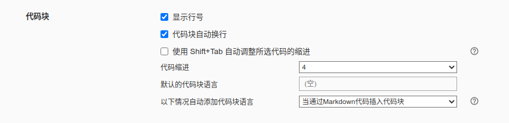
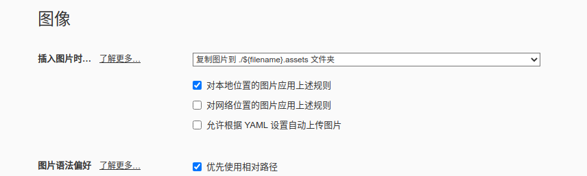
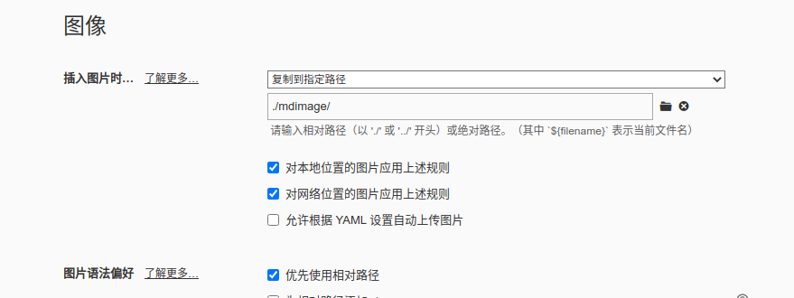

# 多级标题

# 一级标题

## 二级标题

### 三级标题

（# + ==空格== + 内容 + 回车）

或用快捷键 ==Ctrl + 1~6==，==Ctrl + 0== 为清除标题格式


---

# 有序列表

1. （数字 + . +  ==空格== + 内容 + 回车）
2. （当需要结束时，连按两下回车或者按向下方向键）
3. （当在中间某行添加或删除行时后面的序号也会相应+-1）

1. 嵌套
   2. 鼠标选中内容，按住==Tab==键：降级
2. 鼠标选中内容，按住==Shift + Tab==：升级

或选中内容用快捷键==Ctrl + Shift + [==


---

# 无序列表


* 无序列表
* 无序列表

（*或-后，==一定要有空格！==）

（有序列表和无序列表可以交叉使用）

或使用快捷键 ==Ctrl + Shift + ]==


* 无序列表1
* 无序列表2
  * 无序列表2.1
  * 无序列表2.2
* 无序列表3

（==Ctrl + Tab==；==Ctrl + Shift + Tab==级别升降）


* 无序列表1
* 无序列表2
  1. 有序列表2.1
  2. 有序列表2.2
* 无序列表3

==需要先完成升降级再使用 Ctrl + Shift + [==


* 无序列表1
* 无序列表2
  1. 有序列表2.1
  2. 有序列表2.2
     - 无序列表2.2.1
     - 无序列表2.2.2
* 无序列表3

==需要先完成升降级再使用 Ctrl + Shift + ]==


---

# 任务列表

- [ ] 任务列表1

- [ ] 任务列表2

- [x] 任务列表3

文本格式：==-== + ==空格== + ==[==  + ==空格== + ==]== + ==空格==

或用快捷键：==Ctrl + Shift + X==


---

# 表格

创建方式：|表格|表格|表格| + 回车

注意：添加一行，只需按下Ctrl + 回车

| 表格 | 表格 | 表格 | 表格 |
| ---- | :--: | :--: | ---: |
| 1    |  2   |  3   |    4 |
|      |      |      |      |

或者用快捷键：==Ctrl + T==

鼠标右键可进行添加行或列的操作


---

# 行内代码

创建方式：==反引号== + ==内容== + ==反引号==

或用快捷键：==Ctrl + Shift + 反引号==

`Java`是一门计算机语言，`C++`也是一门计算机语言。


---

# 代码块

相关设置：Markdown

创建方式：==反引号== + ==反引号== + ==反引号== (+ ==语言类型==) ；或者：==~== + ==~== + ==~== (+ ==语言类型==)

快捷键：==Ctrl + Shift + K==（如果有搜狗输入法的悬浮键盘弹出，则表明与软键盘的快捷键产生了冲突，需要更改下输入法快捷键设置）

~~~c
#include <stdio.h>
int main(void)
{
 printf("Hello world!");
 
 return 0;
}
~~~


```c
#include <stdio.h>
int main(void){
    printf("Hello world!");
    
    return 0;
}
```


---

# 图片

创建方式：==!== + ==[]== + ==()== + ==回车== + ==选择图片==

快捷键：==Ctrl + Shift + I==

可直接将文件夹与网络同步的设置：

一般个人使用设置：
